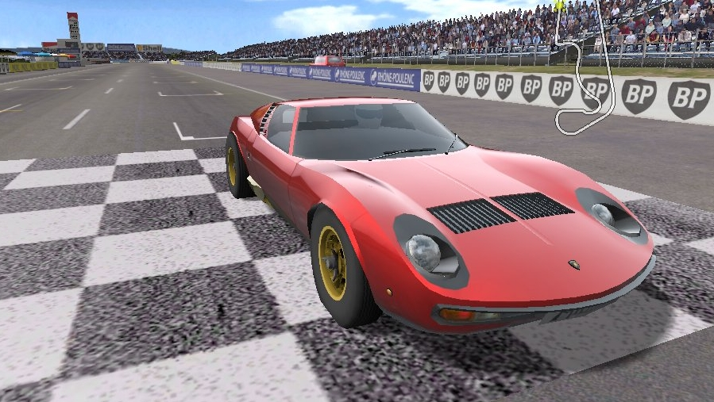

VDrift - a car racing simulator for multiple platforms
======================================================

VDrift is a cross-platform, open source driving simulation made with drift
racing in mind. The driving physics engine was recently re-written from scratch
but was inspired and owes much to the Vamos physics engine. It is released under
the GNU General Public License (GPL) v3. It is currently available for Linux,
FreeBSD, Mac OS X and Windows.

Mission Statement
-----------------

The goals of the VDrift project are:

- to be a high-quality, open source racing simulation featuring enjoyable and
  challenging gameplay;
- to take advantage of modern computing hardware to accurately simulate vehicle
  physics in rich and immersive racing environments; and
- to provide a platform for creative experimentation to a community of
  developers and artists.

Saying more than 1000 words
---------------------------

See also
--------

- [wiki.VDrift.net/About_the_project](http://wiki.VDrift.net/About_the_project)
- [wiki.VDrift.net/License](http://wiki.VDrift.net/License)

Hardware Requirements
=====================

CPU
---

VDrift requires a relatively fast CPU. A 2 GHz or better clock speed is
recommended, although it should be possible to run VDrift with a 1 GHz or better
CPU.

GPU
---

VDrift requires a recent nVidia or ATI graphics card. Some Intel graphics cards may work with recent drivers.

A nVidia GeForce 7-series or ATI Radeon X1000-Series card is recommended in
order to enable all the visual effects. By reducing or disabling some of the
display options, it should be possible to play VDrift with a nVidia GeForce 2 or
better.

HDD
---

VDrift takes up quite some harddisk space. The VDrift Data alone is about 1.6 GB
in size and you will need to check it out, first and install it afterwards. So
be prepared for handling some 3 - 5 GB.

RAM
---

VDrift consumes 300 MiB of memory space on a typical run. 512 MiB of
memory may be sufficient on some operating systems. 1 GiB or more is
recommended and required for larger tracks.

See also
--------

- [wiki.VDrift.net/Hardware_requirements](http://wiki.VDrift.net/Hardware_requirements)

Dependencies
============

Make sure you have all the required libraries and build tools. Make sure you
also have the development files for each of the libraries. Your Linux
distribution may have different package names and/or bundled differently. The
lists below should give enough information to search for applicable packages
within your distribution's package manager.

Build Tools
-----------

The required build tools include:

- g++ - The GNU C++ compiler
- scons - A replacement for Make

Libraries
---------

The required libraries include:

- libsdl - Simple Direct Media Layer
- libglew - OpenGL extension utilities
- sdl-gfx - Graphics drawing primitives library for SDL
- sdl-image - Image file loading library for SDL
- vorbisfile - File loading library for the ogg vorbis format
- libvorbis - The Vorbis General Audio Compression Codec
- bullet C++ Libraries (BulletCollision, BulletDynamics, LinearMath)
- libcurl - For managing data download from the net.
- libarchive - API for managing compressed files.

Packages
--------

VDrift needs the following packages to run:

- vdrift-data - Content from the old Sourceforge repository

Installing Dependencies on Ubuntu Linux
---------------------------------------

Ubuntu does not include a libbullet package, but getdeb does. To add the
getdeb-repository to your sources-list.d:

    wget -q -O - http://archive.getdeb.net/getdeb-archive.key | sudo apt-key add - 
    sudo sh -c 'echo "deb http://archive.getdeb.net/ubuntu natty-getdeb games" > /etc/apt/sources.list.d/getdeb.list'
    sudo apt-get update

Ubuntu 11.04 (Natty Narwhal) does contain libglew1.5, only. To install
libglew1.6 and its development headers:

    wget http://archive.ubuntu.com/ubuntu/pool/universe/g/glew/libglew1.6_1.6.0-3_amd64.deb
    sudo dpkg -i libglew1.6_1.6.0-3_amd64.deb
    rm libglew1.6_1.6.0-3_amd64.deb
    
    wget http://archive.ubuntu.com/ubuntu/pool/universe/g/glew/libglew1.6-dev_1.6.0-3_amd64.deb
    sudo dpkg -i libglew1.6-dev_1.6.0-3_amd64.deb
    rm libglew1.6-dev_1.6.0-3_amd64.deb

All other required packages can be installed using this command:

    sudo apt-get install g++ libarchive-dev libarchive-dev libasio-dev \
                         libboost-dev libcurl4-gnutls-dev libdrm-dev \
                         libgl1-mesa-dev libglu1-mesa-dev libkms1 \
                         mesa-common-dev libsdl-gfx1.2-dev libsdl-image1.2-dev \
                         libsdl-net1.2-dev libvorbis-dev freeglut3 libbullet0 \
                         libbullet-dev scons

Downloading Dependencies on Windows
-----------------------------------

Download the dependencies for Windows:

- Windows: `git clone https://github.com/VDrift/VDrift-win.git`

Downloading Dependencies on Mac OS
----------------------------------

Download the dependencies for Mac OS:

- Mac OS: `git clone https://github.com/VDrift/VDrift-mac.git`

See also
--------

- [wiki.VDrift.net/Software_requirements](http://wiki.VDrift.net/Software_requirements)

Downloading VDrift
==================

For downloading the source code from the repository execute

    git clone https://github.com/VDrift/VDrift.git VDrift

Downloading VDrift Data
-----------------------

VDrift Data is expected to reside in a folder called data in the root of VDrift,
so change your directory to the root of the sources:

    cd VDrift

Currently the VDrift Data is still hosted at Sourceforge, so to getting it
requires checking out the repository with subversion:

    svn checkout https://vdrift.svn.sourceforge.net/svnroot/vdrift/vdrift-data data

See also
--------

- [wiki.VDrift.net/Getting_the_latest_release](http://wiki.VDrift.net/Getting_the_latest_release)
- [wiki.VDrift.net/Getting_the_development_version](http://wiki.VDrift.net/Getting_the_development_version)

Compiling VDrift
================

To compile VDrift you only need to run `scons` in the root directory of the
sources. You can use some flags to enable options. To compile for a 64 bits
machine, turn off debugging, use the bullet physics engine you just installed
and install VDrift to the default directory run:

    scons arch=a64 release=1 extbullet=1 prefix=/usr/local

See also
--------

- [wiki.VDrift.net/Compiling](http://wiki.VDrift.net/Compiling)

Installing VDrift
=================

To install VDrift, you need to run `sudo scons install` in the root directory of
the sources. You can use some flags in this step, too. To set the prefix to the
default location explicitely for example run:

    sudo scons install prefix=/usr/local

See also
--------

- [wiki.VDrift.net/Installing](http://wiki.VDrift.net/Installing)

Cleaning up VDrift
==================

Building the project creates several artifacts that do not need to be stored,
because they can be regenerated on demand. Cleaning them up can be done with
scons, too:

    scons --clean

To remove all additional temporary files:

    rm -rf .sconf_temp/ .sconsign.dblite config.log vdrift.conf

Everything further
==================

For configuring, running and extending the game, for playing, contributing and
developing please search the wiki for an article on your topic:

- [wiki.VDrift.net/Main_Page](http://wiki.VDrift.net/Main_Page)
